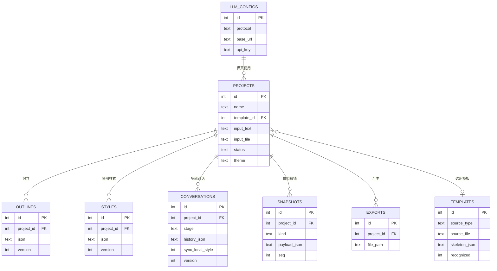

# 产品规格文档（PRD）：AI PPT 生成工具

| 项目 | 内容 |
|------|------|
| 产品名称 | AI PPT 生成器（暂定） |
| 文档版本 | v1.3（对话优化两阶段贯穿 + 一致性规则 + 快照撤销） |
| 文档日期 | 2026-08-02 |
| 产品经理 | 许老板（产品通代笔） |
| 目标用户 | 单机本地使用的个人 / 团队 |
| 建议技术栈 | Web（前端不限）+ Java + SQLite + JDK 1.8 + LLM 接入 |

---

## 1. 问题陈述（Why 优先于 What）

**用户痛点：** 从零制作演示文稿是一个**高重复、低快乐**的流程。用户通常要先在 Word/脑子里整理内容，再手动排版成幻灯片，中间的大量时间耗在"组织逻辑"和"套模板"上，而不是"表达观点"。现有 PPT 工具只解决"画"的环节，不解决"想"和"组织"的环节。

**模板痛点（本版新增）：** 企业/团队往往已有**固定的品牌模板或汇报风格 PPT**，新产出的汇报必须"长成那个样子"。现有 AI 工具强行套用自带模板，导致**生成结果不符合组织规范、无法直接使用**。用户需要一个能**借用任意既有 PPT 版式**、同时让内容与样式都贴合组织的工具。

**目标场景：** 用户有一句想法、一段文字、或一份已有的 Word/Markdown 文档，希望**快速得到一份结构清晰、可直接使用的 PPTX**；且能**导入一份与本主题无关但版式规范的 PPT 作为模板**，让 AI 套用其版式与风格；在真正落地生成前能**先看到效果并修改**——因为 PPTX 一旦生成再去改版式，成本很高（不可逆的消费体验）。

**个人 / 团队价值：**
- 把"内容 → 大纲 → 版式"三段从手动变为半自动，生成时间从**小时级**降到**分钟级**。
- 内容与样式都由 LLM 优化：**内容更精炼专业（润色）**，**样式贴合组织规范（模板套用 + LLM 设计决策）**。
- 用 AI 做**初稿组织者**，人工保留**最终裁决权**（通过预览编辑）——防止 AI 生成后无法修改而弃用。
- 单机本地部署，数据不出本机，满足内容私密性诉求。

**竞争风险：** 市面上 AI PPT 工具（如 Gamma、Tome、Presentations.AI）多为 SaaS 在线产品，存在付费墙、数据上云、**无法套用自有模板**三大痛点。我们的差异化是**本地化 + 自定义 LLM + 模板套用 + 内容/格式双通道优化**。

---

## 2. 目标（Goals）

> 每个目标都要回答"凭什么算成功"，区分用户目标与业务目标。

### 用户目标
1. **从任意输入到结构化大纲**：用户用自然语言、纯文本、Markdown 或 Word 其中任意一种方式，都能得到一份结构化 PPT 大纲。
2. **生成前必可预览**：用户在最终落盘 PPTX **之前**，能完整看到每页效果，并就地修改文字、顺序、层级。
3. **一键导出可编辑的 PPTX**：预览确认后，一键生成符合模板风格、**所有文本与形状均可继续编辑**、可被 PowerPoint / WPS 正常打开的 .pptx。
4. **套用任意模板**：用户可导入一份与本主题无关但版式规范的 .pptx 作为模板，系统提取其版式骨架并应用到新内容；不导入时使用内置预设模板。

### 业务目标
5. **验收成功率**：用户"生成 → 打开 PPTX 无报错"的比例 ≥ 95%。
6. **二次使用率**：前 30 天内，单人重复使用 ≥ 3 次（说明真的解决了日常工作痛点，而非一次性尝鲜）。
7. **LLM 适配成本**：新增一种"OpenAI 兼容"或"Anthropic 兼容"供应商，只需配置 baseUrl + API Key，不需改代码。
8. **模板复用率**：导入过模板的用户中，≥ 50% 在后续制作中再次使用同一模板（说明模板套用真的解决了高频诉求）。

---

## 3. 非目标（Non-Goals）

> 明确"这个功能**不**做什么"，防止范围蔓延。

1. **不做在线多人协作 / SaaS 托管**：v1 定位单机本地工具。多人并发、云端账号、权限体系均属未来（P2）。
2. **不做复杂版式/动画/图表拖拽编辑器**：v1 的"编辑"限大纲级（文字、顺序、标题层级、备注、简单主题切换），不做像素级版式拖拽。复杂动画留给 PowerPoint 本身。
3. **不做模板市场 / 模板商城**：v1 内置 3~5 套预设模板 + 支持用户本地导入，但**不做在线购买/下载模板**的业务。
4. **不做图片/视频素材 AI 生成**：涉及图片布局占位可预留字段，但 v1 不接文生图，避免范围爆掉。
5. **不做"已有 PPT → 全部内容可逆向编辑"的通用解析**：v1 从导入 PPT **仅提取版式骨架（占位符位置/尺寸/主题色/字体）**，不承诺反向还原其全部内容与动画。完整逆向工程另立项目。
6. **不做除 .pptx 外的导出格式**：v1 只导出 .pptx（PowerPoint 2007+ / WPS 兼容）。PDF 导出作为 P1。

---

## 4. 用户故事（User Stories）

> 标准格式：作为 [角色]，我希望 [行为]，以便 [价值]。按优先级排序。

### P0 —— MVP 必备
- **作为内容创作者，我希望能粘贴一段自然语言描述生成演示文稿大纲，以便不用提前手动搭结构。**
  - Given 我输入"帮我做个关于'AI 转型'的 10 页汇报 PPT"
  - When 我点击生成大纲
  - Then 系统返回一份结构完整、含 10 页左右大纲的 JSON，且每页有标题和要点
- **作为文档撰写者，我希望上传一个 Word/Markdown/文本文件后自动提取大纲，以便复用已有材料不重复输入。**
  - Given 我上传 .docx / .md / .txt 文件
  - When 后端解析完并交给 LLM 整理
  - Then 系统生成基于原文内容的大纲，而非凭空联想
- **作为演示者，我希望能预览每一页的效果，以便在生成前发现并修正结构问题。**
  - Given 我已有大纲
  - When 我查看预览
  - Then 系统以幻灯片缩略图形式渲染每页，还原最终版式
- **作为演示者，我希望在预览里直接修改某页标题/要点/顺序，以便最终文件符合我的表达。**
  - Given 预览态下某页文字不够准确
  - When 我就地编辑
  - Then 修改即时反映到预览，并作为生成 .pptx 的依据
- **作为用户，我希望一键导出 .pptx，以便直接交付或继续在 PowerPoint 里精修。**
  - Given 我已确认大纲
  - When 我点击"生成 PPTX"
  - Then 系统返回可下载的 .pptx，且内容与最近一次预览一致
- **作为团队/个人，我希望导入一份已有的但与本主题无关的 PPT 作为模板，以便新产出符合组织既有的版式与风格。**
  - Given 我上传一个 .pptx（即使内容与本次无关）
  - When 系统解析该文件
  - Then 提取出"版式骨架"（页面类型、占位符位置/尺寸、主题色、字体），供新内容套用
  - Given 导入的模板没有可识别的占位符/主题
  - Then 系统明确提示"未识别到版式骨架"，并回退到内置预设模板，而非报错
- **作为用户，当我不导入模板时，我希望从内置预设模板中选用，以便快速开始。**
  - Given 没有导入外部模板
  - When 我新建项目
  - Then 提供一套内置预设模板（≥3 套）供选择，默认采用其一
- **作为演示者，我希望系统自动润色我的标题、要点与备注内容，以便表达更精炼专业、且保留我的本意。**
  - Given 我提交了大纲初稿
  - When 内容优化开启
  - Then LLM 对全文标题/要点/备注进行润色，输出优化后的内容 JSON
  - Given 某句润色偏离我的本意
  - Then 我可在预览中手动改回（内容可编辑），系统不强制采纳
- **作为用户，我希望系统自动优化版式样式（配色/字体/字号/对齐/间距），以便套用模板后无需手动调整细节。**
  - Given 已选定模板骨架
  - When 格式优化开启
  - Then LLM 分析骨架风格并输出结构化的"设计决策 JSON"（非像素命令），交由引擎精确执行
  - Given 生成后的某页布局不佳
  - Then 我可在预览中手动微调，最终 .pptx 仍保持可编辑
- **作为演示者，我希望在预览时用自然语言与 AI 对话，让 AI 按我的指令局部优化内容或格式，以便不亲自动手也能精修。**
  - Given 我已在预览界面、形成初步内容 JSON 与样式 JSON
  - When 我输入"第3页标题改成更有力"或"全文加深主色"
  - Then AI 定位到对应的页/元素，只修改用户指令指向的部分，其他内容与样式保持不变（增量不越界）
  - Given 修改后预览实时刷新
  - Then 我可不满意随时撤销回上一轮，或继续追加指令多轮迭代，直到满意再导出
- **作为演示者，我希望多轮对话中 AI 能记住我之前的修改意图，以便不重复说明。**
  - Given 我已连续对话多轮
  - When 我说"这页也像刚才那样改"
  - Then AI 结合对话历史理解"刚才那样"指代之前的修改，保持一致风格

### P1 —— Should Have
- **作为用户，我希望对话中可点选页面/元素来精确指定优化对象，以便指代更准确。**
- **作为用户，我希望通过一个设置页配置 LLM 的 baseUrl / API Key / 兼容协议，以便自由选用任意供应商。**
- **作为用户，我希望生成的大纲自动带"演讲者备注"，以便讲演时有提词。**
- **作为用户，我希望对自己的常用模板做收藏/复用管理，以便下次一键复用。**
- **作为用户，我希望导出 PDF 预览版，以便快速分发给不装 Office 的人审阅。**

### P2 —— Future
- **作为用户，我希望从已有 .pptx 反解析出可编辑大纲，以便"改别人做的稿子"。**
- **作为用户，我希望插入 AI 生成的图片占位，以便演示更直观（v1 仅留字段）。**
- **作为多用户团队，我希望数据可同步或迁移，以便协作（v1 为单机）。**

---

## 5. 需求（Requirements）

### 5.1 Must-Have（P0）

| ID | 需求 | 验收标准（Acceptance Criteria） |
|----|------|-------------------------------|
| P0-1 | **多源输入**：支持自然语言文本框、.md、.txt、.docx 上传 | [ ] 文本框可输入 ≥1 句中英文自然语言<br>[ ] 上传 .docx/.md/.txt 后可提取纯文本进行后续处理<br>[ ] 非法文件类型/超限文件有明确错误提示 |
| P0-2 | **LLM 大纲生成**：调用 LLM 产出**结构化 JSON 大纲** | [ ] 输入任意合法内容必返回可解析的 JSON<br>[ ] 返回非 JSON / 缺关键字段时自动重试 1 次并给降级提示<br>[ ] 支持 OpenAI 兼容 + Anthropic 兼容两种协议 |
| P0-3 | **JSON 大纲 schema**（前后端单一事实来源） | 见下方「5.4 大纲 JSON Schema」 |
| P0-4 | **预览渲染**：基于大纲渲染幻灯片缩略图 | [ ] 每页呈现标题 + 要点 + 布局，还原主题色<br>[ ] 支持 16:9 与 4:3 切换<br>[ ] 大纲为空时显示空态提示 |
| P0-5 | **预览内编辑**：就地修改文字/顺序/层级 | [ ] 可增删页面、调整页面顺序<br>[ ] 可修改页内标题、要点、备注<br>[ ] 修改后导出内容与最新预览一致 |
| P0-6 | **PPTX 生成（Apache POI）**：以大纲+样式为输入生成 .pptx | [ ] 产物可被 PowerPoint / WPS 正常打开，无损坏警告<br>[ ] 产物中所有文本、形状、文本框均为**可继续编辑的原生元素**（非图片/非只读）<br>[ ] 若 POI 生成失败，返回清晰错误并保留上次预览态<br>[ ] 所有中文字符正常显示（字体处理正确） |
| P0-7 | **项目持久化（SQLite）**：大纲/样式/模板/配置/历史落库 | [ ] 中途刷新/重启，未完成的项目可恢复<br>[ ] LLM 配置持久化，重启不丢失<br>[ ] 已导入的模板骨架持久化，可跨项目复用 |
| P0-8 | **模板导入与骨架提取**：上传外部 .pptx，提取"版式骨架" | [ ] 上传 .pptx 后成功识别页面类型、占位符位置/尺寸、主题色、字体<br>[ ] 识别无占位符/主题的模板时，给出可读提示并回退到内置预设，不崩溃<br>[ ] 提取的骨架可保存为"模板"供后续复用 |
| P0-9 | **内容 LLM 优化（润色）**：对标题/要点/备注做全文润色 | [ ] 润色后保留用户原意，仅提升精炼度与专业性<br>[ ] 输出结构化内容 JSON，结构与大纲 schema 一致<br>[ ] 用户可在预览中逐条改回，不被强制采纳 |
| P0-10 | **格式 LLM 优化（设计决策）**：LLM 分析骨架产出版式设计决策 | [ ] LLM 输出结构化的"设计决策 JSON"（配色/字体/字号/对齐/间距），非像素级指令<br>[ ] 决策被引擎精确转换成可编辑的样式属性<br>[ ] 决策可用/可调试，异常决策回退到骨架默认样式 |
| P0-11 | **对话式多轮优化（两阶段）**：生成前设约束 + 预览微调 | **[阶段A·生成前]** 输入原始想法后可用对话设定风格/页数/要点密度，LLM 带约束生成首版<br>[阶段B·预览微调] 预览界面提供对话输入框，支持自然语言指令局部改内容/格式<br>[ ] 服务端保留多轮历史（conversation_id），AI 能理解"刚才那种改法"等指代<br>[ ] 指令精确到页/处，只改用户指向元素，其余不动（增量不越界）<br>[ ] 每轮对话后预览实时刷新，多轮叠加有效<br>[ ] 预览阶段的对话微调**常驻保留**，导出前随时可继续微调 |
| P0-12 | **增量补丁（diff）机制**：对话优化以最小 diff 合并，非整份重写 | [ ] LLM 返回 JSON Pointer 形式的 diff（replace/add/remove）<br>[ ] 阶段A 首版为"带约束完整 JSON"，阶段B 后续为 diff<br>[ ] 引擎校验 path 越界/value 非法，越界拒绝并提示<br>[ ] 未指代的页面/字段不得被改动<br>[ ] 合并后内容/样式 JSON 与预览一致 |
| P0-13 | **局部/全局一致性规则**：局部样式改动可选同步为全局默认 | [ ] 单页样式改动默认只改该页（越界保护）<br>[ ] 提供"同步为默认样式"开关；开启时询问或默认全局套用<br>[ ] 连续修改同类元素样式 ≥2 次提示是否全局应用<br>[ ] 全局指令（"全文统一"）必然全局应用 | 
| P0-14 | **快照撤销（近5档）**：多轮对话可回退到最近状态 | [ ] 保留最近 5 个内容/样式快照可回退<br>[ ] 保留"回到初始生成态"一键操作<br>[ ] 超 5 个快照自动丢弃最早 |

### 5.2 Nice-to-Have（P1）

| ID | 需求 | 说明 |
|----|------|------|
| P1-1 | 内置预设模板库（≥3 套） | 颜色/字体/标题版式各异，供未导入模板时选用 |
| P1-2 | LLM 设置页 | baseUrl、API Key、协议选择、可测试连接 |
| P1-3 | 演讲者备注 | 大纲含 notes 字段，落盘到 PPT 备注栏 |
| P1-4 | 模板收藏与复用管理 | 保存/重命名/删除/一键套用已导入模板 |
| P1-5 | PDF 导出 | 用于快速审阅分发 |

### 5.3 Future（P2）

| ID | 需求 | 说明 |
|----|------|------|
| P2-1 | 已有 .pptx 完整反解析（含内容、动画） | 完整逆向工程，另立项目 |
| P2-2 | AI 图片占位/生成 | 预留 imagePrompt 字段 |
| P2-3 | 多用户 / 数据同步 | 需重构持久层，单机期不做 |
| P2-4 | 模板在线市场 | 需要服务端与内容安全审核，属商业扩展 |

### 5.4 大纲 JSON Schema（核心设计）

预览与生成的**单一事实来源**。LLM 产出该结构，前端按它渲染，POI 按它输出。

```json
{
  "meta": {
    "title": "AI 转型汇报",
    "theme": "corporate_blue",
    "aspectRatio": "16:9",
    "author": "许老板"
  },
  "slides": [
    {
      "layout": "title",
      "title": "AI 转型战略汇报",
      "subtitle": "2026 Q3 · 数字化转型中心",
      "notes": "开场强调转型必要性"
    },
    {
      "layout": "bullet",
      "title": "核心观点",
      "bullets": [
        "AI 从工具走向生产力",
        "降本约 30% 的可行路径",
        "三阶段落地路线"
      ],
      "notes": ""
    },
    {
      "layout": "content",
      "title": "落地路线图",
      "bullets": ["Phase1 试点", "Phase2 推广", "Phase3 规模化"],
      "imagePrompt": ""  // P2 预留
    }
  ]
}
```

**字段说明：**
- `layout`：枚举（title / bullet / content / agenda / closing 等），驱动 POI 选择版式。
- `bullets`：要点数组，最多建议 5 条防溢出。
- `notes`：演讲者备注，P1 落盘。
- **约束**：POI 遇到未知 `layout` 时回退到 `bullet`，不得抛异常。

### 5.5 样式/设计决策 JSON Schema（新增 · 格式优化通道）

> 内容与样式**彻底分离**的第二份中间产物。LLM 分析模板骨架，产出结构化"设计决策"，引擎按其精确执行。这份 JSON 是**可编辑、可调试**的（非像素级指令）。

```json
{
  "meta": {
    "aspectRatio": "16:9",
    "masterWidth": 960,
    "masterHeight": 540
  },
  "palette": {
    "background": "#FFFFFF",
    "primary": "#185FA5",
    "secondary": "#378ADD",
    "accent": "#E6F1FB",
    "titleText": "#0C447C",
    "bodyText": "#2C2C2A"
  },
  "typography": {
    "titleFont": "微软雅黑",
    "bodyFont": "微软雅黑",
    "titleSizePt": 30,
    "bulletSizePt": 18,
    "noteSizePt": 12
  },
  "layoutRules": {
    "titlePosition": { "x": 0.06, "y": 0.06, "w": 0.88, "h": 0.14 },
    "bodyPosition":  { "x": 0.08, "y": 0.24, "w": 0.84, "h": 0.7 },
    "bulletLineSpacing": 1.5,
    "align": "left"
  }
}
```

**字段说明：**
- `palette`：调色板，源自模板主题色 + LLM 微调。
- `typography`：字体/字号档位，源自模板字体 + LLM 决策。
- `layoutRules`：用**百分比相对坐标**（x/y/w/h ∈ 0~1）描述区域，适配任意宽高比。
- **约束**：`layoutRules` 取值必须落在合法区间；LLM 产出非法值（如坐标越界、字号过负）时，引擎**回退到骨架默认值**并记录日志，不抛异常。

### 5.6 模板骨架（TemplateSkeleton · 模板应用核心）

> 从导入 PPT 提取、或内置预设，成为可复用的**版式与风格定义**。新内容 + 骨架 → 套用生成。这是"模板驱动"能力的载体。

```java
public class TemplateSkeleton {
    private String id;                 // 模板唯一标识
    private String sourceType;         // IMPORTED(外部导入) | BUILTIN(内置)
    private String sourceFile;         // 来源 pptx 路径(导入时)
    private AspectRatio aspectRatio;   // 16:9 / 4:3
    // 识别的占位符布局组：页面类型 -> 布局坐标集合
    private Map<String, List<PlaceholderRegion>> layoutGroups;
    private Palette palette;           // 主题色
    private Typography typography;     // 字体体系
    private boolean recognized;        // 是否成功识别出版式(否则回退内置)
}

public class PlaceholderRegion {
    private String type;               // TITLE / CONTENT / SUBTITLE / PICTURE / NOTES
    private double x, y, w, h;         // 相对百分比坐标 0~1
}
```

**提取规则：**
- 遍历导入 PPT 的每页，识别标题/正文文本框、形状占位符，记录其类型与相对位置尺寸。
- 汇总多页结构，归并为若干"页面类型模板"，形成可复用 `layoutGroups`。
- 读取主题配色（`theme1.xml` 里的 accent/color 定义）与字体。
- **未识别到有效占位符**（如纯背景图模板）时：`recognized=false`，给出提示并回退内置预设，不强制。

### 5.7 LLM Provider 抽象（关键设计）

> 你的要求是"OpenAI 兼容 + Anthropic 兼容，baseUrl 可自由配置"。这是本项目**最重要**的架构决策。

```java
public interface LlmProvider {
    // 协议类型
    LlmProtocol protocol();           // OPENAI_COMPAT / ANTHROPIC_COMPAT
    // 以给定系统提示 + 用户内容，返回 LLM 原始文本
    CompletableFuture<String> chat(ChatRequest req);
    // 校验配置连通性（设置页"测试连接"用）
    boolean testConnection();
}
```

- `OpenAiProvider`：POST `{baseUrl}/v1/chat/completions`，标准 OpenAI 请求体。
- `AnthropicProvider`：POST `{baseUrl}/v1/messages`，采用 Anthropic 请求/响应格式。
- `LlmProviderFactory`：根据用户保存的 `protocol + baseUrl` 运行时创建实例，**切换供应商零改码**。
- 连接超时 / 重试 / API Key 均从 SQLite 配置读取。

### 5.8 LLM 角色设计（内容/格式双通道 + 对话优化）

| 通道 | LLM 角色 | 输入 | 输出 |
|------|----------|------|------|
| 内容 | 大纲组织者 + 润色助手 | 用户输入/原文 + 大纲 schema | 内容 JSON（结构+润色） |
| 格式 | 视觉设计顾问 | 模板骨架 + 内容 JSON + 设计约束 | 设计决策 JSON |
| 模板匹配 | 布局映射助手 | 内容 JSON 各页 + 骨架 layoutGroups | 每页 → 页面类型映射 |
| 对话·阶段A(生成前约束) | 需求澄清助手 | 用户意图 + 对话约束 + 大纲/样式 schema | **带约束的完整首版 内容/样式 JSON** |
| 对话·阶段B(预览微调) | 协作式编辑助手 | 多轮历史 + 当前内容/样式 JSON + 用户指令 | **最小增量补丁（diff）** |

### 5.9 对话式多轮优化（两阶段贯穿 · 核心交互）

> 对话式优化**贯穿全流程两个阶段**，都是常驻能力：
> - **阶段 A「生成前约束」**：用户输入原始想法后，通过对话设定初始约束（风格/页数/要点密度），LLM 带着约束生成内容/样式，减少后期返工。
> - **阶段 B「预览微调」**：在预览界面（内容+样式已生成）与 AI 多轮对话，**就地微调预览结果**——这是对话优化的**主战场**，常驻不可移除。
>
> 两个阶段共用同一套 diff 机制；差异只在输入状态（A 无内容 JSON，只有用户意图；B 有已生成的 JSON）。

#### 5.9.1 交互形态（两阶段）

```
┌─ 阶段 A：生成前约束对话 ─────────────────────┐
│ 输入原始想法 → 对话框：帮我做成10页、商务风、少字  │
│      ↓ 用户约束 + 意图 传给 LLM                │
│ 生成内容 JSON + 样式 JSON（带着约束）            │
└──────────────────────────────────────────────┘
                    │
                    ▼
┌─ 阶段 B：预览微调对话（常驻·主战场）────────────┐
│ 预览界面 ─ 右侧对话面板 ─► 用户指令（自然语言/点选）│
│   ① 服务端保留多轮历史                            │
│   ② 意图路由：改内容 or 改格式 or 全局             │
│   ③ LLM 产出最小 diff → 引擎校验合并              │
│   ④ 预览实时重绘 → 可多轮叠加 → 可快照回退         │
│   满意后点"导出" → 生成 PPTX                     │
└──────────────────────────────────────────────┘
```

#### 5.9.2 核心机制：**增量补丁（diff）而非整份重写**

> **关键约束**：对话优化绝不能让 LLM 重发整份 JSON——那样会丢失用户之前的所有定制，且极易"越界改到没让改的地方"。正确做法是让 LLM 只输出**最小增量补丁**，由引擎校验后合并。

```json
// 用户指令："第3页标题改成更有力；全文加深主色"
{
  "targetPage": 3,                 // 可空：精确到页
  "contentPatch": [
    { "path": "slides[2].title", "op": "replace", "value": "降本增效：AI 的确定性回报" }
  ],
  "stylePatch": [
    { "path": "palette.primary", "op": "replace", "value": "#0A3D62" }
  ]
}
```

**合并规则：**
- `targetPage` 指明作用页；缺省且上下文指向全局时，允许命中 `style` 的全局项（如调色板）。
- 每条 patch 用 JSON Pointer 形式 `path` 精确定位，`op` ∈ `replace / add / remove`。
- **引擎校验**：`path` 越界（如指向不存在页/字段）→ 拒绝该条并提示；`value` 不合法（如超范围坐标/色值）→ 回退。
- **越界保护**：对话优化**只允许修改用户指令明确指向的元素**，未经指代的页面/字段不得被改动（这是"精确到页/处"需求的落地）。

#### 5.9.3 指代解析（路由）

- 系统在发送给 LLM 前，**注入当前页聚焦状态**（用户点选了第几页/哪个元素），帮助 LLM 理解"这页""这个标题"。
- 首轮指令先做一次**意图路由**：改内容（文本措辞/结构）vs 改格式（配色/字体/布局）→ 走内容增量或格式增量通道。
- 支持全局指令（"全文统一风格"）与局部指令（"这页标题改有力点"）并存，由 LLM 结合上下文判定 `targetPage` 是否填。
- **阶段 A 特有**：输入阶段无既有 JSON，对话产出的是"一份带约束的完整内容/样式 JSON"（首次生成），不是 diff。

#### 5.9.4 局部 vs. 全局一致性规则（关键设计决策）

> 用户说"第3页标题改深蓝"，如果只改第 3 页，全文其他页标题颜色不变，导出时会"跳色"破整。需要一个明确规则避免两难。

- **默认行为（局部优先）**：对话中对"单页样式"的改动**只作用于被指代的那页**，严格遵循越界保护，不擅自联动其他页。
- **可配置开关「局部样式改动同步为默认」**：
  - 开启：当用户改某页的**某项样式**（如标题色/字号），系统询问或默认将该改动**同步为全局默认样式**，其余页套用（保持整体一致）。
  - 关闭（默认）：只改该页，其余页不动，保留局部差异。
- **判定范围**：`GLOBAL_STYLE` 意图（用户说"全文统一/整体"）必然全局应用；`STYLE` 意图（说"这页"）走本地优先，是否同步由开关决定。
- **默认建议**：阈值取"同一类元素样式被连续修改 ≥2 次视为想全局改"，提示用户确认后应用全局——兼顾一致与用户控制。

#### 5.9.5 上下文管理

- **服务端保留**本轮对话历史（`conversation_id`），每次请求携带 `history + 当前页状态 + 用户指令`。
- 对话令牌预算：超长时对早期历史做**摘要压缩**，保障一致性同时控制成本（见 5.9.7 数据模型）。
- 每轮对话后，内容/样式 JSON 更新并持久化，**预览即时重绘**；用户不满意可随时回退（基于 JSON 版本快照，见下）。

#### 5.9.6 回退/撤销（快照列表）

- 内容 JSON、样式 JSON 均保存**版本快照**（复用 `version` 字段）。
- **改进：保留最近 5 个快照**，提供快速回退列表，用户可选择回到近几轮任一状态；**第 6 个及更早的快照被丢弃**（控制存储与 UI 复杂度）。
- **保留"回到初始生成态"**：一键丢弃全部对话修改，回到首轮生成结果。
- **不做严格任意步跳转**：超过 5 步的历史不保留，避免存储膨胀与界面混乱（这是刻意的复杂度控制）。

#### 5.9.7 新增数据表：对话会话（含一致性配置）

```sql
-- 对话会话（两阶段的多轮优化：阶段A约束 / 阶段B微调）
CREATE TABLE conversations (
    id            INTEGER PRIMARY KEY AUTOINCREMENT,
    project_id    INTEGER NOT NULL REFERENCES projects(id),
    stage         TEXT NOT NULL,      -- CONSTRAINT(生成前) | POLISH(预览微调)
    history_json  TEXT NOT NULL,     -- 多轮对话历史(含摘要压缩后)
    sync_local_style INTEGER DEFAULT 0, -- 5.9.4 一致性开关
    version       INTEGER DEFAULT 1,
    created_at    TIMESTAMP DEFAULT CURRENT_TIMESTAMP,
    updated_at    TIMESTAMP
);
-- 快照表（撤销用，保留最近5个）
CREATE TABLE snapshots (
    id          INTEGER PRIMARY KEY AUTOINCREMENT,
    project_id  INTEGER NOT NULL REFERENCES projects(id),
    kind        TEXT NOT NULL,       -- CONTENT | STYLE
    payload_json TEXT NOT NULL,
    seq         INTEGER NOT NULL,    -- 快照序号
    created_at  TIMESTAMP DEFAULT CURRENT_TIMESTAMP
);
```

> **存储取舍**：对话历史与内容/样式 JSON 分离存储，`conversations.history_json` 负责记忆，`outlines`/`styles` 负责产物，`snapshots` 负责撤销回退。——"聊了几轮""当前什么样""能回退到哪"三者分离，互不干扰。

---

## 6. 成功指标（Metrics）

> 指标必须可观测、可归因、有基线。

| 层级 | 指标 | 定义 | 基线 | 目标（首月） |
|------|------|------|------|--------------|
| 北极星 | 生成确认率 | 预览后点击"导出 PPTX"的项目数 / 生成出大纲的项目总数 | 暂无 | ≥ 60% |
| 驱动 | 大纲生成成功率 | LLM 返回可解析内容 JSON 的请求占比 | 暂无 | ≥ 95% |
| 驱动 | 样式决策生成成功率 | LLM 返回可解析"设计决策 JSON"且取值合法的占比 | 暂无 | ≥ 90% |
| 驱动 | 弃用率（预览后未导出的） | 生成大纲后 30 分钟内未导出的占比 | 暂无 | ≤ 40% |
| 健康 | PPTX 打开成功率 | 导出后能被 Office/WPS 无警告打开且可编辑的占比 | 暂无 | ≥ 95% |
| 健康 | 平均制作耗时 | 从输入到成功导出 .pptx 的分钟数 | 手动约 60-120 分钟 | ≤ 8 分钟 |
| 健康 | 模板复用率 | 导入过模板的用户中，后续再次使用同一模板的占比 | 暂无 | ≥ 50% |
| 驱动 | 对话优化采用率 | 进入预览的项目中，至少进行 1 轮对话优化的占比 | 暂无 | ≥ 40% |
| 驱动 | 生成前约束使用率 | 首版生成前使用过对话设约束（阶段A）的项目占比 | 暂无 | ≥ 30% |
| 健康 | 对话越界比例 | 对话中"单条 diff 被引擎拒绝/回退"的比例（越低越好） | 暂无 | ≤ 10% |
| 驱动 | 对话后导出率 | 进行过对话优化后完成导出的占比（对比未对话项目） | 暂无 | ≥ 未对话的导出率 +10% |

> **说明**：单机本地工具可埋点仅存本机 SQLite（不进云端），记录次数与耗时即可，规避隐私问题。

---

## 7. 技术架构（Tech Architecture）

> 框架栈建议（基于 jdk8 + 轻量本地的约束）。

### 7.1 技术选型建议

| 层 | 技术 | 理由 |
|----|------|------|
| 前端框架 | **Vue 3 + Vite**（也可 React，不限制） | 组件化好维护，预览画布用 canvas |
| 前端预览 | `pptx-preview` 或自定义渲染 | 把大纲 JSON 渲染成缩略页 |
| 后端框架 | **Spring Boot 2.7.x**（支持 jdk8 的最后一个主版本） | jdk8 约束下最成熟的 Web 框架 |
| PPTX 生成 | **Apache POI**（`poi-ooxml` 5.2.x） | 纯 Java、jdk8 兼容、直接操作 pptx |
| 持久化 | **SQLite + sqlite-jdbc**（或 JPA 映射） | 单文件、零部署、符合单机诉求 |
| LLM 客户端 | **HttpClient 原生封装**（或 spring-retrofit 风格） | 轻量、可自定义协议；避免重量级 SDK 与 jdk8 冲突 |
| 构建 | Maven | 成熟稳定 |

### 7.2 分层结构

```
┌─────────────────────────────┐
│  展示层 (Web)  Vue3 + Canvas │
│  - 输入/预览/大纲编辑/模板导入 │
└───────────┬─────────────────┘
            │ HTTP / WebSocket
┌───────────▼─────────────────┐
│  业务层 (Spring Boot 2.7)   │
│  Controller → Service → DAO │
│  ├ LlmProvider (抽象)        │
│  ├ ContentEngine (内容润色)   │
│  ├ StyleEngine  (格式决策)   │
│  ├ TemplateExtractor(骨架)   │
│  └ PptxGenerator (ApachePOI)│
└───────────┬─────────────────┘
            │ sqlite-jdbc
┌───────────▼─────────────────┐
│  持久层  app.db (SQLite)     │
│ projects/outlines/styles/    │
│ templates/llm_configs        │
└─────────────────────────────┘
```

### 7.3 数据库设计（SQLite）

> 说明：数据模型用 mermaid ER 图在 PRD 附录里给出，这里给出可直接建表的 schema。

```sql
-- 项目（一次 PPT 制作任务）
CREATE TABLE projects (
    id          INTEGER PRIMARY KEY AUTOINCREMENT,
    name        TEXT NOT NULL,
    template_id INTEGER,            -- 选用的模板(可空,空表用内置默认)
    input_text  TEXT,              -- 自然语言/文本输入原文
    input_file  TEXT,              -- 上传文件本地路径（若有）
    status      TEXT DEFAULT 'draft',  -- draft|preview|exported
    theme       TEXT DEFAULT 'corporate_blue',
    aspect_ratio TEXT DEFAULT '16:9',
    created_at  TIMESTAMP DEFAULT CURRENT_TIMESTAMP,
    updated_at  TIMESTAMP
);

-- 大纲（JSON 整体存储，单一事实来源）
CREATE TABLE outlines (
    id         INTEGER PRIMARY KEY AUTOINCREMENT,
    project_id INTEGER NOT NULL REFERENCES projects(id),
    json       TEXT NOT NULL,      -- 5.4 节的 JSON 字符串
    version    INTEGER DEFAULT 1,
    created_at TIMESTAMP DEFAULT CURRENT_TIMESTAMP,
    updated_at TIMESTAMP
);

-- 导出记录
CREATE TABLE exports (
    id         INTEGER PRIMARY KEY AUTOINCREMENT,
    project_id INTEGER NOT NULL REFERENCES projects(id),
    file_path  TEXT NOT NULL,
    file_size  INTEGER,
    created_at TIMESTAMP DEFAULT CURRENT_TIMESTAMP
);

-- LLM 配置（支持多套，切换删除）
CREATE TABLE llm_configs (
    id         INTEGER PRIMARY KEY AUTOINCREMENT,
    name       TEXT NOT NULL,
    protocol   TEXT NOT NULL,       -- OPENAI_COMPAT | ANTHROPIC_COMPAT
    base_url   TEXT NOT NULL,
    api_key    TEXT,
    model      TEXT,
    is_active  INTEGER DEFAULT 0,
    created_at TIMESTAMP DEFAULT CURRENT_TIMESTAMP
);

-- 样式/设计决策（格式优化通道的单一事实来源，对应 5.5 节 JSON）
CREATE TABLE styles (
    id         INTEGER PRIMARY KEY AUTOINCREMENT,
    project_id INTEGER NOT NULL REFERENCES projects(id),
    json       TEXT NOT NULL,       -- 5.5 设计决策 JSON
    source     TEXT DEFAULT 'llm',  -- llm | skeleton(未用LLM时套用骨架默认)
    version    INTEGER DEFAULT 1,
    created_at TIMESTAMP DEFAULT CURRENT_TIMESTAMP
);

-- 模板（外部导入或内置预设，对应 5.6 节骨架）
CREATE TABLE templates (
    id            INTEGER PRIMARY KEY AUTOINCREMENT,
    name          TEXT NOT NULL,
    source_type   TEXT NOT NULL,    -- IMPORTED | BUILTIN
    source_file   TEXT,             -- 导入的源 pptx 路径
    skeleton_json TEXT NOT NULL,    -- 提取出的 TemplateSkeleton JSON
    palette_json  TEXT,             -- 主题色
    recognized    INTEGER DEFAULT 1, -- 未识别时回退内置
    is_builtin    INTEGER DEFAULT 0,
    created_at    TIMESTAMP DEFAULT CURRENT_TIMESTAMP
);
```

> **存储取舍**：`outlines.json` 与 `styles.json` 整条存 JSON，简化版本管理，且二者天然解耦——**改内容不动样式，改样式不动内容**，回退/重算成本低。若后续需要差异对比再拆表。

---

## 8. 核心流程（Core Flow）

> 橙色节点为新增能力（模板/双通道优化）。紫色节点为对话式优化（贯穿两阶段）。

```
用户输入(NL/文件) ＋ 选择/导入模板
      │
      ▼
[文件则先解析提取纯文本] ──► [选定模板：导入.pptx提取骨架 或 选内置预设]
      │                          │
      ▼                          ▼
 ┌──────────────────────────────────────────────┐
 │ ★ 阶段A「生成前约束对话」：可就风格/页数/要点    │
 │   密度等对话设定约束（可选，默认可跳过直生成）    │
 └──────────────────────────────────────────────┘
      │
      ▼
 ┌──────────────────────────────────────────────┐
 │ ① 内容通道：LLM 带约束生成并润色内容 JSON       │
 │   （LLM 校验可解析 → 失败重试1次 → 降级提示）   │
 └──────────────────────────────────────────────┘
      │
      ▼
 ┌──────────────────────────────────────────────┐
 │ ② 格式通道：LLM 分析骨架 → 产出设计决策 JSON   │
 │   （非法取值回退骨架默认，不抛异常）              │
 └──────────────────────────────────────────────┘
      │
      ▼
  【预览】前端按"内容 JSON + 样式 JSON"渲染缩略图
      │
      ▼
 ┌──────────────────────────────────────────────┐
 │ ★ 阶段B「预览微调对话」（常驻主战场）           │
 │   ├─ 意图路由（改内容/改格式/全局）＋一致性规则   │
 │   ├─ LLM 产出最小增量 diff → 引擎校验并合并     │
 │   ├─ 预览实时刷新 / 快照撤销(近5档) / 多轮叠加   │
 │   └─ 满意后点"导出"                           │
 └──────────────────────────────────────────────┘
      │
      ▼
  【生成】Apache POI 消费"内容 + 决策"→ 逐 shape 写 .pptx（原生可编辑）
      │
      ▼
   导出成功 → 记录到 exports → 完成
```

---

## 9. 风险清单（Risks）

| 级别 | 风险 | 影响 | 缓解措施 |
|------|------|------|----------|
| 🔴 高 | **LLM 返回非预期格式 / 幻觉** | 大纲结构错乱，用户体验崩塌 | JSON schema 强校验 + 重试 1 次 + 降级为"纯文本分段落" |
| 🔴 高 | **外部模板解析失败**（占位符/主题不规范） | 模板套用失效 | 骨架提取失败时回退内置预设 + 可读提示，不崩溃 |
| 🟠 高 | **格式 LLM 产出非法设计决策**（坐标越界/尺寸异常） | 版式破版 | 决策 JSON 取值范围校验，非法值回退骨架默认 |
| 🔴 高 | **中文乱码**（POI 字体处理不当） | 生成的 PPT 中文变方块 | 显式设置中文字体（如宋体/微软雅黑），集成测试含中文用例 |
| 🟠 中 | **jdk8 与新 LLM SDK 不兼容** | 部分供应商 SDK 要求更高 JDK | 自研轻量 HTTP 客户端，不依赖重量级 SDK |
| 🟠 中 | **API Key / baseUrl 配置错误** | 用户连不上 LLM | 设置页提供"测试连接"，错误信息可读 |
| 🟡 中 | **套用模板后文本溢出**（模板区域小，内容多） | 单页内容挤爆 | POI 侧做溢出保护；bullets 限 5 条；字号自适应 |
| 🟡 低 | **SQLite 并发写入**（单机下风险低） | 多标签页同时操作 | 单机场景用单写连接 + WAL 模式 |
| 🟠 高 | **对话越界修改**（AI 改到用户没让改的页/处） | 用户定制被破坏，二次返工 | 增量 diff 校验，未指代元素一律拒改；diff 引擎硬校验 |
| 🟠 中 | **指代理解错误**（"这页""刚才那种"识别偏差） | 改错对象 | 注入当前页聚焦状态 + 会话历史；保留"该指令执行前"快照可回退 |
| 🟡 中 | **多轮对话 token 累积膨胀** | 成本与延迟上升 | 早期历史摘要压缩（见 5.9.6）；对话上限提示 |

---

## 10. 隐私与合规（Privacy）

- **数据不出本机**：用户内容、大纲、导出文件均存本地，不做云端留存。
- **LLM 调用不可避免**：需向用户明示"内容将发送至所配置的 LLM 供应商"。可在设置页增加提示与"匿名化（去除文件名/作者）"开关。
- **API Key 存储**：SQLite 本地存储，建议提示用户注意本机文件权限；不做无意义混淆承诺。

---

## 11. 开放问题（Open Questions）

| # | 问题 | 归属 | 是否阻塞 |
|---|------|------|----------|
| 1 | LLM 供应商是否需要实名/企业认证才能用？影响默认推荐配置 | 商务/法务 | 非阻塞（配置化规避） |
| 2 | 中文字体的默认档位：宋体/黑体/微软雅黑选哪个做默认主题？ | 设计 | 非阻塞 |
| 3 | 预览渲染精度要到什么程度？逐页高清 or 缩略图即可？ | 工程/设计 | 阻塞（影响前端工作量） |
| 4 | 是否需要"常用 Prompt 模板"能力（如周报、复盘、给高管汇报）？ | 产品 | 非阻塞（可作 P1 增强） |
| 5 | .docx 解析用 Apache POI 的 text extraction，是否覆盖表格内容？ | 工程 | 非阻塞（v1 只处理正文） |
| 6 | 外部模板的基色/字体提取，不同 PPT 主题规范差异大，首版识别范围到哪？ | 工程 | 阻塞（决定 TemplateExtractor 工作量） |
| 7 | "格式 LLM 优化"默认开还是关？开则每次生成多一次 LLM 调用与耗时 | 产品 | 非阻塞（建议默认开，可关） |
| 8 | 内容润色是否允许改变原有要点条数（增/删）？ | 产品 | 非阻塞（建议默认只润色不增删，避免结构失控） |
| 9 | 对话优化的"全局指代"门槛：用户说"全文统一"，是逐页命中还是一键全局改？ | 产品/工程 | 非阻塞（建议：显式全局词才允许全局，默认精确到页） |
| 10 | 对话历史保留的轮数上限（避免 token 无限膨胀）？ | 工程 | 非阻塞（建议如 20 轮后的历史做摘要压缩） |

---

## 12. 里程碑与时间线（Timeline）

> 单机本地小工具，建议按 **8-10 周**推进（模板/双通道使工作量上升，估算供参考）。

| 阶段 | 周期 | 交付物 |
|------|------|--------|
| P0 · 骨架 | 第 1-2 周 | Spring Boot 骨架 + SQLite 建表（含 styles/templates/conversations）+ 前后端连通 |
| P0 · LLM 链路 | 第 3 周 | LlmProvider 抽象 + 内容 JSON 生成与校验 |
| P0 · 模板提取 | 第 4-5 周 | TemplateExtractor（外部 .pptx 骨架提取）+ 内置预设模板库 |
| P0 · 双通道优化 | 第 6 周 | ContentEngine 润色 + StyleEngine 设计决策 |
| P0 · 预览编辑 + POI | 第 7-8 周 | 预览画布（内容+样式渲染）+ 就地编辑 + POI 生成（原生可编辑） |
| P0 · 对话式优化 | 第 9 周 | 对话面板 + 意图路由 + diff 合并引擎 + 多轮历史 + 一致性规则 + 快照撤销(近5档) |
| P0 · 阶段A约束 | 第 9.5 周 | 生成前约束对话接入首版生成链路 |
| P1 · 增强 | 第 10-11 周 | 设置页、测试连接、模板收藏、PDF 导出、备注、点选指代 |

**建议**：MVP 聚焦 P0-1 到 P0-14，先跑通"输入 → **(阶段A约束对话)** → 模板 → 内容+格式优化 → 预览 → **(阶段B预览微调对话)** → 可编辑导出"全闭环，再上 P1。**模板提取、格式通道、对话 diff 是本项目三大不确定点**——模板与格式建议第 4 周就用真实 PPT 做冒烟测试；**对话 diff 是交互核心，建议第 9 周用 mock LLM 先行打通校验/合并/撤销/一致性命中链路**，尽早暴露指代与越界问题。

---

## 13. 附录

### 13.1 数据库 ER 关系（mermaid）



---

*本文档由「产品通」（产品管理专家）代笔。聚焦"为什么做、做什么、怎么验收"，技术架构建议满足 jdk8 + Web + SQLite 的可落地约束。*
